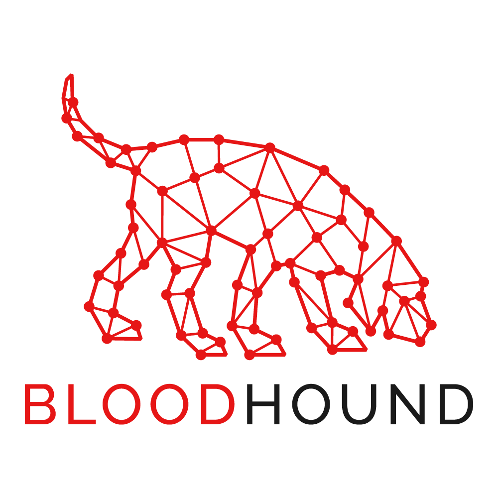

# awesome-bloodhound

A curated list of awesome Bloodhound resources



This list is for links to learn and use the awesome Active Directory reconnaissance tool Bloodhound. It will for the most part consist of tools available on Github, videos demonstrating the tools, blog posts and wikis.

You can contribute by submitting pull requests, creating issues with suggestions or write to me [@chryzsh](https://twitter.com/chryzsh) or ping @crusher on the [Bloodhound Slack](http://bloodhoundgang.herokuapp.com/). I have made a markdown template for adding new links here -> [Contributing](#-contributing).

Join the [Bloodhound Slack](http://bloodhoundgang.herokuapp.com/)!

Thank you to all of the authors of the content referenced in this page, and to all who contribute here and in the Bloodhound Slack.

Table of Contents
=================
- [awesome-bloodhound](#awesome-bloodhound)
- [Table of Contents](#table-of-contents)
  - [Getting Started](#getting-started)
  - [Features and updates](#features-and-updates)
  - [Usage guides](#usage-guides)
  - [Tools](#tools)
  - [Methodology and reporting](#methodology-and-reporting)
  - [Cypher](#cypher)
  - [Videos](#videos)
  - [Ebooks](#ebooks)
  - [Social](#social)
  - [Tips and tricks](#tips-and-tricks)
  - [Contributing](#contributing)

## Getting Started

If this is your first time using Bloodhound , the Bloodhound repository is the place to start. Its wiki will show you have to download, install and get started using Bloodhound.

* [BloodHoundAD/BloodHound](https://github.com/BloodHoundAD/BloodHound) - The Bloodhound repository
* [Bloodhound Wiki](https://github.com/BloodHoundAD/BloodHound/wiki) - The Bloodhound repository wiki
* [Neo4j](https://neo4j.com/) - Neo4j, Bloodhound's graph database

## Features and updates

* [Introducing BloodHound](https://wald0.com/?p=68) - Introducing BloodHound by wald0
* [BloodHound 1.3 – The ACL Attack Path Update](https://wald0.com/?p=112) - Description of the 1.3 feature update by [@wald0](https://twitter.com/_wald0)
* [SharpHound: Evolution of the BloodHound Ingestor](https://blog.cptjesus.com/posts/newbloodhoundingestor) - Description of the rewritten Sharphound ingestor by [CptJesus](https://twitter.com/cptjesus).
* [BloodHound 1.4: The Object Properties Update](https://blog.cptjesus.com/posts/bloodhoundobjectproperties) - Description of the 1.4 update.
* [SharpHound: Technical Details](https://blog.cptjesus.com/posts/sharphoundtechnical) - Technical details of the Sharphound ingestor
* [SharpHound: Target Selection and API Usage](https://blog.cptjesus.com/posts/sharphoundtargeting) - Description of how collection is done
* [BloodHound 1.5: The Container Update](https://blog.cptjesus.com/posts/bloodhound15) - Description of the 1.5 update by CptJesus
* [BloodHound 2.0](https://blog.cptjesus.com/posts/bloodhound20) - Description of the 2.0 update by CptJesus
* [BloodHound 2.1: The Fix Broken Stuff Update](https://blog.cptjesus.com/posts/bloodhound21) - Description of the 2.1 update by CptJesus
* [Introducing BloodHound 3.0](https://posts.specterops.io/introducing-bloodhound-3-0-c00e77ff0aa6) - Introducing BloodHound 3.0 blog post
* [BloodHound 3.0](example.com) - Video recording of the presentation of Bloodhound 3.0
* [BloodHound 3.0](http://bit.ly/3837gTx) - Slide deck for the slides presenting Bloodhound 3.0

## Usage guides

* [BloodHound offical documentation](https://bloodhound.readthedocs.io) - Official documentation on readthedocs.io
* [SadProcessor/HandsOnBloodHound](https://github.com/SadProcessor/HandsOnBloodHound) - Material for the "Hands-On BloodHound" Workshop
  * [HandsOnBloodHound.pdf](https://github.com/SadProcessor/HandsOnBloodHound/blob/master/Workshop/HandsOnBloodHound.pdf) - Slides for the above talk at Brucon2019, by @SadProcessor
* [Bloodhound](https://en.hackndo.com/bloodhound/) - BloodHound usage article, by pixis
* [BloodHound Tips and Tricks - riccardoancarani.it](https://www.riccardoancarani.it/bloodhound-tips-and-tricks/) - Tips and tricks for Bloodhound workflow and using the functionality.

## Tools

* [Bloodhound 3.0](https://github.com/BloodHoundAD/BloodHound/releases/tag/3.0.0) - Working snapshot of the Bloodhound 3.0 release.
* [BloodHoundAD/SharpHound3](https://github.com/BloodHoundAD/SharpHound3) - SharpHound 3, the Bloodhound 3.0 ingestor.
* [BloodHoundAD/BloodHound-Tools](https://github.com/BloodHoundAD/BloodHound-Tools) - Miscellaneous tools for BloodHound
  - [BloodHound Database Creator](https://github.com/BloodHoundAD/BloodHound-Tools/tree/master/DBCreator) - This python script will generate a randomized data set for testing BloodHound features and analysis.
  - [BloodHound Analytics](https://github.com/BloodHoundAD/BloodHound-Tools/blob/master/bloodhoundanalytics.py) - This python script will analyze existing BloodHound data in a neo4j database.
* [BloodHoundAD/SharpHound](https://github.com/BloodHoundAD/SharpHound) - The BloodHound C# Ingestor
* [fox-it/BloodHound.py](https://github.com/fox-it/BloodHound.py) - A Python based ingestor for BloodHound
* [peterhgombos/bloodhounddemo](https://hub.docker.com/r/peterhgombos/bloodhounddemo) - Docker container containing a quick demo database for Bloodhound using the official neo4j image.
* [seajaysec/cypheroth](https://github.com/seajaysec/cypheroth) - Automated, extensible toolset that runs cypher queries against Bloodhound's Neo4j backend and saves output to csv.
* [SadProcessor/WatchDog](https://github.com/SadProcessor/WatchDog) - WatchDog is a BloodHound Data scanner [NodeWeight]
* [SadProcessor/CypherDog](https://github.com/SadProcessor/CypherDog) - PowerShell Cmdlets to interact with BloodHound Data via Neo4j REST API.
* [GoFetchAD/GoFetch](https://github.com/GoFetchAD/GoFetch) - GoFetch is a tool to automatically exercise an attack plan generated by the BloodHound application.
* [fox-it/aclpwn.py](https://github.com/fox-it/aclpwn.py) - Active Directory ACL exploitation with BloodHound.
* [fox-it/bloodhound-import](https://github.com/fox-it/bloodhound-import) - Python based BloodHound data importer
* [vysecurity/ANGRYPUPPY](https://github.com/vysecurity/ANGRYPUPPY) - Bloodhound Attack Path Automation in CobaltStrike
* [porterhau5/BloodHound-Owned](https://github.com/porterhau5/BloodHound-Owned) - A collection of files for adding and leveraging custom properties in BloodHound.
* [Coalfire-Research/Vampire](https://github.com/Coalfire-Research/Vampire) - Vampire is an aggressor script which integrates with BloodHound to mark nodes as owned.
* [chrismaddalena/Fox](https://github.com/chrismaddalena/Fox) -A companion tool for BloodHound offering Active Directory statistics and number crunching  
* [davidprowe/BadBlood]*(https://github.com/davidprowe/BadBlood) - BadBlood by Secframe fills a Microsoft Active Directory Domain with a structure and thousands of objects.

## Methodology and reporting

* [Introducing the Adversary Resilience Methodology — Part One](https://posts.specterops.io/introducing-the-adversary-resilience-methodology-part-one-e38e06ffd604) - Methodology using Bloodhound for defensive purposes, part one.
* [Introducing the Adversary Resilience Methodology — Part Two](https://posts.specterops.io/introducing-the-adversary-resilience-methodology-part-two-279a1ed7863d) - Methodology using Bloodhound for defensive purposes, part two.
* [Active Directory Security:Beyond the Easy Button](https://adsecurity.org/wp-content/uploads/2019/09/2019-DerbyCon-ActiveDirectorySecurity-BeyondTheEasyButton-Metcalf-Full.pdf) - Defensive Active Directory by Sean Metcalf
* [Troopers 2019: BloodHound and the Adversary Resilience Methodology](https://docs.google.com/presentation/d/14tHNBCavg-HfM7aoeEbGnyhVQusfwOjOyQE1_wXVs9o/edit#slide=id.g4d29456ff7_0_0) - Slide set from the Bloodhound talk at Troopers 2019. See the Videos section for a video of this.
* [BloodHound Head to Tail - Andy Robbins Rohan Vazarkar](https://docs.google.com/presentation/d/1wiiIRyy59lOl3lScCyEuPLK8ms5a55LP-AEgcMxR2hA/edit#slide=id.g35f391192_00) - Derbycon 2019 talk about Bloodhound.  See Videos section for a video of this.
* [BlackHat USA 2019 - Finding Our Path](https://docs.google.com/presentation/d/1lQHTqXZIDxwaIUnXdO-EdvGp79RzH1rbM4zE45Kki2I/edit#slide=id.g35f391192_00) - BlackHat USA 2019 - Finding our Path: How We're Trying to Improve Active Directory Security

## Cypher

* [BloodHound: Intro to Cypher](https://blog.cptjesus.com/posts/introtocypher) - Intro to Cypher
* [awsmhacks/awsmBloodhoundCustomQueries](https://github.com/awsmhacks/awsmBloodhoundCustomQueries) - Collection of Cypher queries
* [Bloodhound Cypher Cheatsheet](https://hausec.com/2019/09/09/bloodhound-cypher-cheatsheet/) - Cheatsheet detailing how to write Cypher queries.
* [Neo4j Drivers & Language Guides](https://neo4j.com/developer/language-guides/) - Neo4j drivers and language guides.
* [Blue Hands On Bloodhound](https://insinuator.net/2019/10/blue-hands-on-bloodhound/) - Data manipulation with Bloodhound.
* [Cypher Query Gallery](https://github.com/BloodHoundAD/BloodHound/wiki/Cypher-Query-Gallery) - Cypher Query Gallery from the official Bloodhound wiki.
* [RamblingCookieMonster/PSNeo4j](https://github.com/RamblingCookieMonster/PSNeo4j) - PSNeo4j is a simple Neo4j PowerShell module, allowing you to quickly build up graph data from any of the technologies PowerShell can interface with.

## Videos

* [Six Degrees of Domain Admin...](https://www.youtube.com/watch?v=lxd2rerVsLo) - Presentation of Bloodhound from 2016 by Andy Robbins, Will Schroeder and Rohan Vazarkar.
* [How BloodHound's Session Collection Works](https://www.youtube.com/watch?v=q86VgM2Tafc) - Brief explanation of session collection by Andy Robbins (wald0).
* [BloodHound 2.1's New Computer Takeover Attack](https://www.youtube.com/watch?v=RUbADHcBLKg) - Brief explanation of a feature in Bloodhound 2.1, by Andy Robbins.
* [TR19: BloodHound and the Adversary Resilience Methodology](https://www.youtube.com/watch?v=0r8FzbOg2YU&t=2400s) - Talk from Trooppers 2019 by the Bloodhound creators about using Bloodhound defensively.
* [BloodHound Head to Tail - Andy Robbins Rohan Vazarkar](https://www.youtube.com/watch?v=fqYoOoghqdE) - Derbycon 2019 talk about Bloodhound
* [BloodHound - Analyzing Active Directory Trust Relationships](https://www.youtube.com/watch?v=gOpsLiJFI1o) - Short usage video on exploring trust relationships by Raphael Mudge.
* [Extending BloodHound for Red Teamers](https://www.youtube.com/watch?v=Pn7GWRXfgeI) - Talk about adapting and extending Bloodhound for red team usage.
* [IppSec - Sizzle](https://www.youtube.com/watch?v=YVhlfUvsqYc&t=2660) - IppSec demonstrates Bloodhound collection, ingestion and usage on the box Sizzle on Hackthebox.
* [IppSec - Reel](https://www.youtube.com/watch?v=ob9SgtFm6_g&t=3503) - IppSec demonstrates Bloodhound collection, ingestion and usage on the box Reel on Hackthebox.
* [Course BloodHound Framework 2 Download BloodHound](https://www.youtube.com/watch?v=_RLdf6JFYfw&list=PLBqdc2sJLjwriZCQ7mcv00727gP3dCiux) - Bloodhound course by Matt harr0ey.
* [Active Directory Security Beyond the Easy Button](https://youtu.be/AZScrF6JxeQ?t=1902) - Active Directory Security Beyond the Easy Button - Sean Metcalf.

## Ebooks

* [The Dog Whisperer’s Handbook](https://insinuator.net/2018/11/the-dog-whisperers-handbook/) - Thorough book detailing almost everything that can be done with Bloodhound written by [@sadprocessor](https://twitter.com/sadprocessor).

## Social

* [Join the BloodHound Slack](http://bloodhoundgang.herokuapp.com) - Slack channel for talk about Bloodhound and other shenanigans.
* [The Official BloodHound Swag Store](https://www.customink.com/fundraising/bloodhound-swag) - The Official BloodHound Swag Store
* [@CptJesus](https://twitter.com/cptjesus) - Bloodhound creator and maintainer
* [@wald0](https://twitter.com/_wald0) - Bloodhound creator and maintainer
* [@harmj0y](https://twitter.com/harmj0y) - Bloodhound creator
* [@SadProcessor](https://twitter.com/sadprocessor) - Writer of The Dog Whisperer's Handbook - See the [Ebooks](#ebooks) section for download.
* [Bloodhound 3.0 tshirt release](https://www.customink.com/fundraising/the-limited-edition-bloodhound-30-release-shirt) - Bloodhound 3.0 t-shirt.
## Tips and tricks

* [Submitting New Attack Primitives](https://github.com/BloodHoundAD/BloodHound/wiki/Submitting-New-Attack-Primitives) - Submitting New Attack Primitives in Bloodhound
* [Stop Bloodhound data gathering? - @jeffmcjunkin](https://twitter.com/jeffmcjunkin/status/1184872807500435456) - How to stop Bloodhound data gathering?
* [Controlling AD Recon (Bloodhound) - @PyroTek3](https://twitter.com/PyroTek3/status/1184935580246904834) - Controlling AD Recon (Bloodhound)
* [Get help from Bloodhound - @wald0](https://twitter.com/_wald0/status/1154440486410579974?s=20) - How do I abuse a relationship that #BloodHound is showing me?
* [Computer objects in Bloodhound - @wald0](https://twitter.com/_wald0/status/1167550622851190784?s=20) - Did you know...
* [Unsupported OS - @aceb0nd](https://twitter.com/aceb0nd/status/1166150922021429248?s=20) - Find unsupported (and potentially vulnerable) Windows OS using this cypher query.

## Contributing

If you want to contribute directly, you can use the following markdown template for creating new entries.
```
* [username/github-repo](https://github.com/username/github-repo) - Brief description.
* []() - 
```